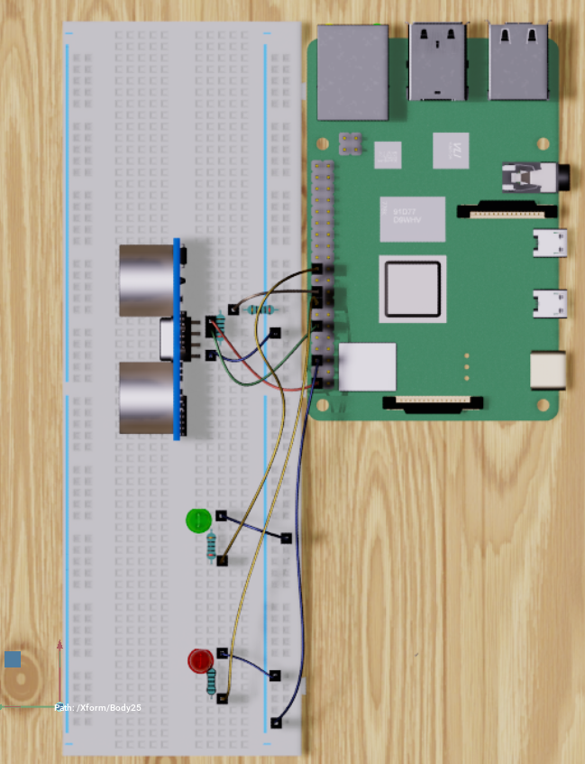
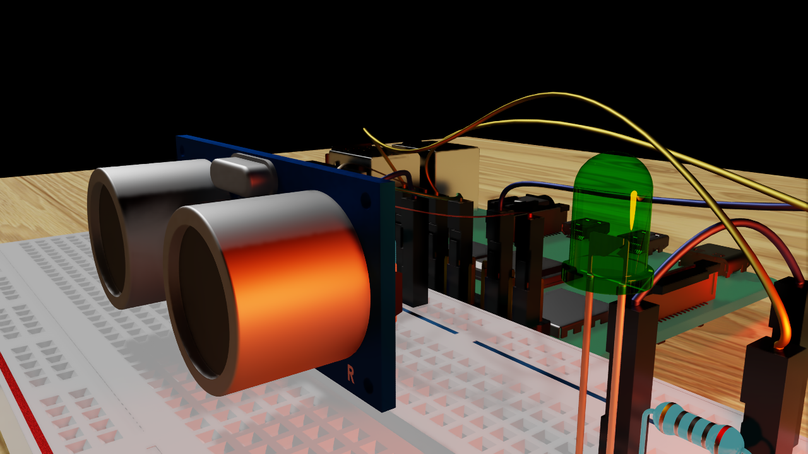
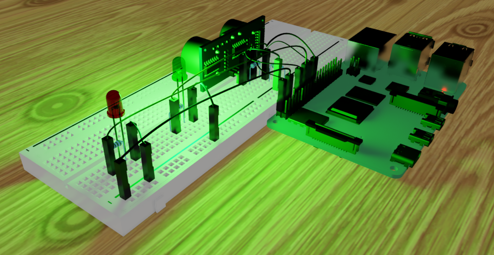

# Digital Twin with ROS2 and Omniverse

This repository contains code for creating a digital twin using ROS2 and Omniverse. The project controls two different LED lamps with an ultrasonic sensor, which is wired to a Raspberry Pi 4.

## Hardware Requirements

- Raspberry Pi 4
- Micro SD Card(For Ubuntu 20.04)
- Ultrasonic sensor HC-SR04 
- 2 LED lamps 
- 330 Ohm Resistors(400 Ohm is also okey)

## Screenshots

You can find screenshots of the project in the `screenshots` directory.

