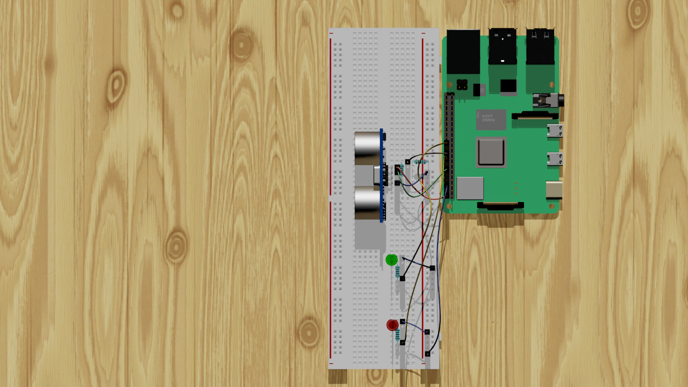

# Digital Twin with ROS2 and Omniverse

This repository contains code for creating a digital twin using ROS2 and Omniverse. The project controls two different LED lamps with an ultrasonic sensor, which is wired to a Raspberry Pi 4.

## Requirements

- ROS2 Foxy
- Raspberry Pi 4
- Ultrasonic sensor
- 2 LED lamps

## Screenshots

You can find screenshots of the project in the `screenshots` directory.

